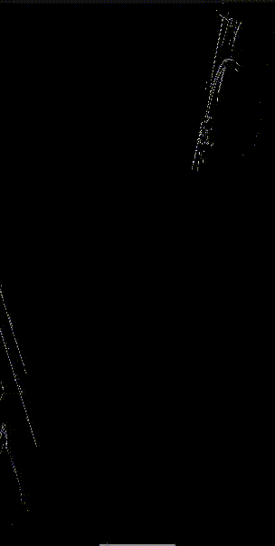

# 📸 Android C++/OpenCV/OpenGL Edge Detector

This project is a real-time, high-performance edge detection viewer for Android. It captures the live camera feed, processes it using native C++ and OpenCV (Canny filter), and renders the result efficiently using OpenGL ES 2.0.

This project fulfills all requirements, including the native C++/OpenCV pipeline, the OpenGL renderer, and the separate TypeScript web viewer.

---

## 🚀 Features Implemented

* **Android:**
    * Live camera feed using the `Camera2` API and an `ImageReader`.
    * High-performance rendering using a `GLSurfaceView` and OpenGL ES 2.0 shaders.
* **C++ / NDK:**
    * Native JNI bridge to connect Kotlin/Java to C++.
    * OpenCV 4.x integration via CMake.
    * Real-time processing: `RGBA` to `Grayscale` conversion and `cv::Canny` edge detection on the native layer.
* **Web Viewer:**
    * A separate `/web` directory containing a debug viewer.
    * Built with TypeScript.
    * Displays a static sample frame and simulated stats.

---

## 🎥 App Demo

Here is a short GIF showing the app in action, performing real-time Canny edge detection.


*(Note: If the GIF doesn't load, you can find it at [YOUR REPO LINK]/blob/main/demo.gif)*

---

## 🛠️ Setup & Build Instructions

To build and run this project, you will need:

1.  **Android Studio** (latest version recommended)
2.  **Android NDK** (v21 or higher, installable via the Android Studio SDK Manager)
3.  **OpenCV Android SDK** (v4.x)

**Build Steps:**

1.  **Clone the Repository:**
    ```bash
    git clone [YOUR REPO LINK]
    cd [PROJECT_FOLDER]
    ```
2.  **Download OpenCV for Android:**
    * Download the [OpenCV Android SDK](https.opencv.org/releases/) (e.g., `opencv-4.5.5-android-sdk.zip`).
    * Unzip it.
3.  **Configure OpenCV in CMake:**
    * This project is set up to find OpenCV. You may need to edit `app/src/main/cpp/CMakeLists.txt` and update the `set(OpenCV_DIR ...)` path to point to the `sdk/native/jni` folder from the OpenCV SDK you just unzipped.
4.  **Open in Android Studio:**
    * Open the project in Android Studio.
    * Let Gradle sync. It will automatically run CMake.
5.  **Build and Run:**
    * Build the project (Build > Make Project).
    * Run the `app` configuration on a connected Android device or emulator.

---

## 🏛️ Architecture & Data Flow

This app uses a clean, one-way data flow to achieve real-time performance:

1.  **Camera2 API:** Captures high-resolution frames and sends them to an `ImageReader`.
2.  **`ImageReader.OnImageAvailableListener`:** Triggers when a new frame is ready.
3.  **JNI Bridge:** The frame data is passed from Kotlin to the native C++ layer via a JNI function (`processFrame`).
4.  **C++ / OpenCV:**
    * The raw frame data is converted into a `cv::Mat`.
    * `cv::cvtColor` converts the RGBA image to Grayscale.
    * `cv::Canny` runs on the Grayscale mat to find the edges.
5.  **OpenGL Texture:** The final, processed 1-channel Canny mat is uploaded to an OpenGL texture ID using `glTexImage2D`.
6.  **`GLSurfaceView.Renderer`:** The `onDrawFrame` method is called, which draws a simple 2D rectangle (quad) to the screen, textured with our processed frame.